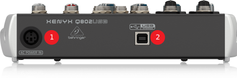
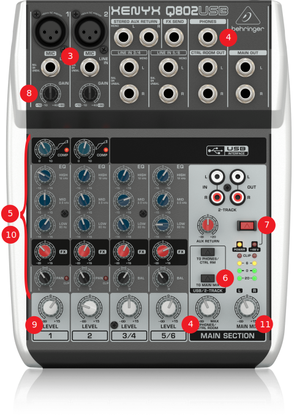

# Audiomikseri
Audiomikseriä käytetään mikrofoneista ja muista äänilähteistä tulevien äänien yhdistämiseen ja siirtämiseen tietokoneelle. 

Jos käytät [langatonta vastaanotinta](../vastaanotin/README.md), niin ota se käyttöön ensin.

## Mikserin käyttöön tarvitaan
* virtajohto
* USB-johto (tyyppi A <-> tyyppi B)
* (XLR-johdot [langattomien mikrofonien vastaanottimesta](../vastaanotin/README.md))

### audiomikseri takaa

  

### audiomikseri päältä

  

## Audiomikserin käyttö
1. Kytke virtajohto takana olevaan `AC POWER IN` -porttiin. ❶
2. Kytke USB-johto takaosan porttiin ja johdon toinen pää tietokoneeseen. ❷
3. Kytke XLR-johdot vasemman yläreunan `LINE IN` -portteihin. ❸
4. Kytke kuulokkeet `PHONES`-porttiin ja säädä kuulokkeiden äänenvoimakkuus haluamaksesi `HEADPHONES / CTRL ROOM`-asetuksella. ❹ 
5. Säädä mikserin säätimet lähtökohtaisesti arvoon 0 (osoitin osoittaa suoraan ylös, paitsi COMP-asetus kello 7). ❺
6. Paina oikean alareunan `TO MAIN MIX` -painike yläasentoon. Ääni siirtyy tietokoneelle, kun tämä nappi on ylhäällä. ❻
7. Jos käytät kondensaattorimikrofoneja, jotka tarvitsevat Phantom-virtaa, niin paina punainen nappi alas. Langattomalla vastaanottimella ja heittomikrofonilla tätä ei tarvita, ne saavat virran omasta virtalähteestään. ❼ 
8. Säädä mikrofonien `GAIN`-asetuksia niin, että mikrofoni ottaa puheen selvästi, mutta ääni ei vielä säröydy. Testaa myös kovemmilla äänenvoimakkuuksilla. ❽ 
9. Säädä alareunan `LEVEL`-asetuksilla kaikki mikserille tulevat äänilähteet keskenään balanssiin. ❾
10. Korjaa tarvittaessa äänen sävyasetuksia `COMP`-, `EQ`- ja panorointisäätimillä. ❿  
11. Säädä oikean alareunan `MAIN MIX`-asetuksella tietokoneelle lähtevän äänilähdön voimakkuutta. ⓫

### Käyttö tietokoneella

 * Audiomikseri näkyy automaattisesti tietokoneella `USB Audio CODEC` -äänitulolaitteena.
 * OBS-ohjelmassa saat lisättyä mikserin seuraavasti:
    1. Valitse *Lähteet (sources)* -> *Lisää* -> *Äänitulo (Microphone input)*.
    2. Valitse *Luo uusi* ja anna nimeksi `audiomikseri`.
    3. Valitse *Laite*-kohtaan `Microphone (USB Audio CODEC)` ja paina *OK*.
    4. Audiomikseri toimii nyt yhtenä äänitulolaitteena OBS-ohjelmassa.
 * Teams-ohjelmassa valitse mikrofoniksi `USB Audio CODEC`. Huomaa, että Teams saattaa automaattisesti määritellä kaiuttimeksi audiomikserin, vaihda kaiutin-kohtaan käyttämäsi kaiutin. 

## Materiaalit:
 * [Tuotesivu](https://www.behringer.com/product.html?modelCode=P0ALM)
 * [Pikaohje (englanti)](https://mediadl.musictribe.com/media/PLM/data/docs/P0ALM/QSG_BE_0601-AFY_XENYX-Q1202USB-1002USB-802USB-502USB_WW.pdf)
 * [Käyttöohje (suomi)](https://mediadl.musictribe.com/media/sys_master/ha5/hd6/8849741283358.pdf)
 * [Käyttöohje (englanti)](https://mediadl.musictribe.com/media/sys_master/hda/hdd/8849411702814.pdf)