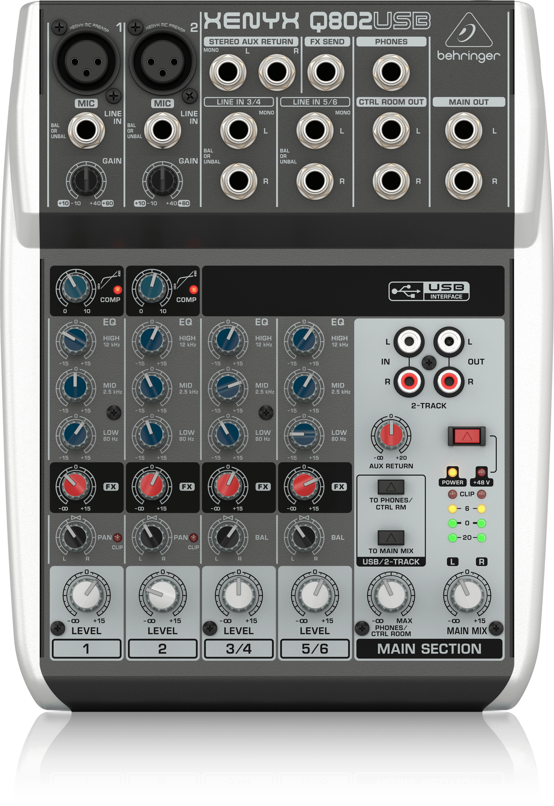
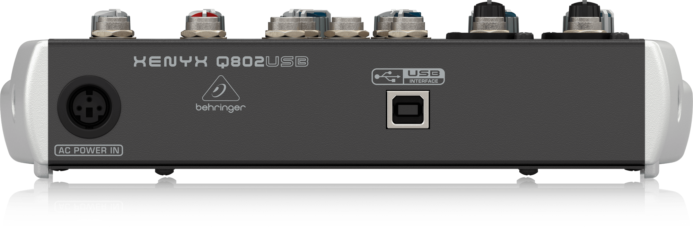

# audiomikseri
Konfiguroi [vastaanotin](../vastaanotin/README.md) ensin, tai samaan aikaan.
Käytetään äänen sisääntulon säätämiseen ja tietokoneeseen siirtämiseen.

## tarvitaan
* virtajohto
* XLR johto [vastaanottimesta](../vastaanotin/README.md).
* mini USB johto

### päältä

  

### takaa

  

## käyttö
1. kytke XLR johto vasemman yläreunan `line in` porttiin.
2. kytke micro USB johto takaosan porttiin ja tietokoneeseen.
3. paina oikean alareunan `to main mix` painiketta.
4. paina punaista nappia.
5. OBS ohjelmassa valitse alaostasta: `sources` -> `microphone input` -> `mixeri` (nimi riippuu muista kiinni olevista laitteista. jos mixeri on ainoa niin Default device valinnan tulisi toimia.)

