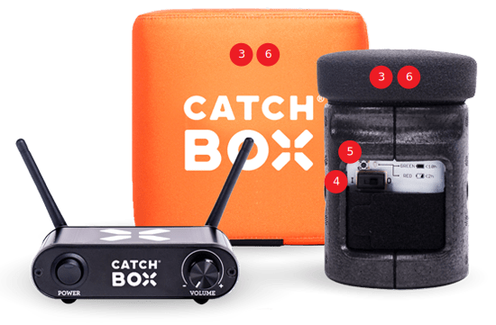
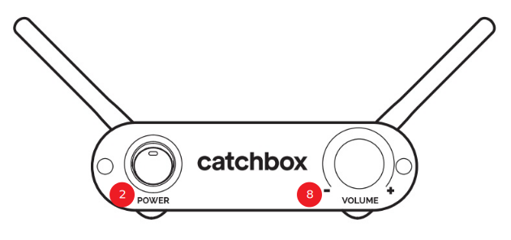
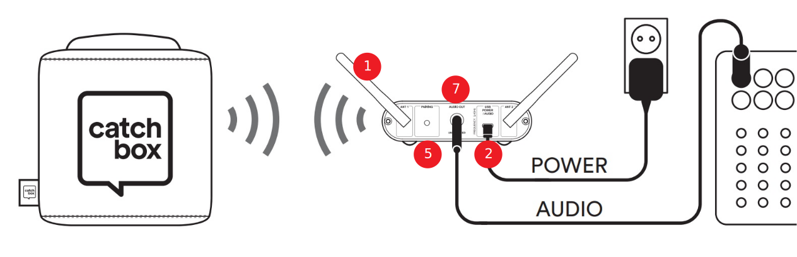

# Catchbox-heittomikrofoni

Käytetään yleisöön heitettävänä mikrofonina. Catchbox-vastaanottimen voi kytkeä suoraan tietokoneeseen tai äänen voi viedä audiomikserille. Jos käytät [audiomikseriä](../audiomikseri/), niin ota se käyttöön ensiksi. 

## Heittomikrofonin käyttöön tarvitaan
* virtajohto
* 3,5mm audiokaapeli, 6,3mm adapteri ja USB-adapteri (kytkeminen tietokoneeseen)
* 6,3mm audiokaapeli (kytkeminen audiomikseriin)
* 2 kpl AA-paristoja

### Heittomikrofoni ja vastaanotin

  

### Vastaanotin

  

### Vastaanottimen kytkentä 

  

## Heittomikrofonin käyttö
1. Ruuvaa antennit kiinni vastaanottimen taakse `ANT 1` ja `ANT 2` -liitäntöihin.
2. Kiinnitä virtajohto vastaanottimen takaosan `5V DC` -liitäntään. Laita vastaanotin päälle etupuolen `POWER`-kytkimestä.
3. Vedä musta mikrofoni pehmustekuutiosta ulos pyöräyttämällä mustaa mikrofonia niin, että mikrofonin saa vedettyä pehmusteesta ilman suurempaa voimaa. Mikrofoni kiinnittyy pehmusteeseen magneetilla.
4. Laita mikrofoni päälle siirtämällä kytkin asentoon `I`. Mikrofonin paristoissa on riittävästi varausta, kun ledvalo on vihreä. Kun ledvalo on punainen, paristot kannattaa vaihtaa. Mikrofoni toimii kahdella AA-koon sormiparistolla, paristokotelo sijaitsee tarranauhan alla.
5. Mikrofoni pitäisi automaattisesti kytkeytyä vastaanottimeen, jolloin sekä mikrofonin ja vastaanottimen valo palaa yhtäjaksoisesti. Tarvittaessa voit parittaa mikrofonin uudelleen vastaanottimen kanssa seuraavasti:
   * Paina vastaanottimen takana `PAIRING`-tekstin alla olevaa nappia. Tällöin etupuolen `POWER`-napin valo alkaa vilkkua tiheästi.
   * Paina mikrofonin virtakytkimen yläpuolella olevaa pientä nappia. Mikrofoni kytkeytyi vastaanottimeen, jos sekä mikrofonin että vastaanottimen vihreä valo alkaa palamaan tasaisesti.
6. Laita mikrofoni takaisin pehmusteeseen kohdistamalla mikrofonin pohjassa ja pehmusteessa olevat mustat kolmiot kohdikkain.
7. Kytke audiokaapeli vastaanottimen takana `AUDIO OUT` -porttiin.
   * Jos kytket vastaanootimen suoraan tietokoneeseen, niin käytä tällöin 3,5 mm audiokaapelia. Tarvitset vastaanottimen päähän sopivan adapterin ja tietokoneeseen USB-porttiin kytkettävän `Catchbox USB Audio adapter` -adapterin. Kytke audiokaapeli adapterin punaiseen porttiin. Jos tietokoneessa on 3,5mm mikrofonitulo, niin kaapelin voi kytkeä myös siihen.
   * Jos kytken vastaanottimen audiomikseriin, niin käytä tällöin 6,3 mm audiokaapelia. Kytke kaapeli audiomikserissä kanavan `1`  tai kanavan `2` `LINE IN` -porttiin. AUdiomikserin kanavissa 3-6 ei ole äänen sisääntulon `GAIN`-säätöä.
8. Säädä vastaanottimelta lähtevää äänenvoimakkuutta vastaanottimen etupuolen `VOLUME`-säätimestä. Audiomikserissä voit säätää äänenvoimakkuutta `GAIN`- ja `LEVEL`-säätimillä.
9. Muista kytkeä mikrofoni pois päältä, kun lopetat heittomikrofonin käytön.   

## Materiaalit
* [Catchbox Lite user manual](https://catchbox.com/user-manuals/catchbox-lite)