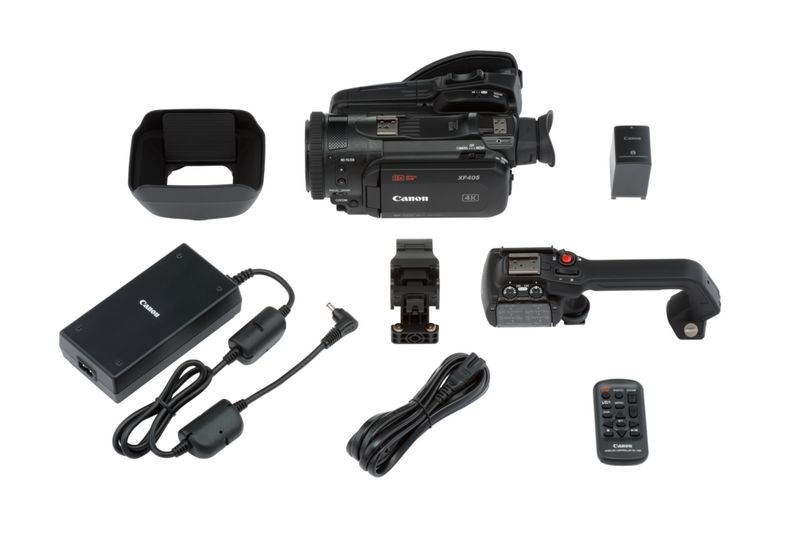

# Kamera
käyttötarkoitusta ei varmaan tarvitse selittää.

## Kameran käyttöön tarvitaan
* jalka
* SDI kaapeli
* virtajohto

### kameran tarvikkeet

  

### SDI OUT ja HDMI OUT

  

## Kameran käyttö
1. kytke virtajohto (kameran etuosan luukun takana)
2. kytke SDI johto kameran sivulta löytyvän luukun taakse.
3. yhdistä kamera [videomikseriin](../videomikseri/README.md)

## Materiaalit
* [Tuotesivu](https://www.canon.fi/video-cameras/xf-405-and-xf-400/)
* [Pikaopas](quick-guide-fi.pdf)
* [Käyttöopas](manual-fi.pdf)