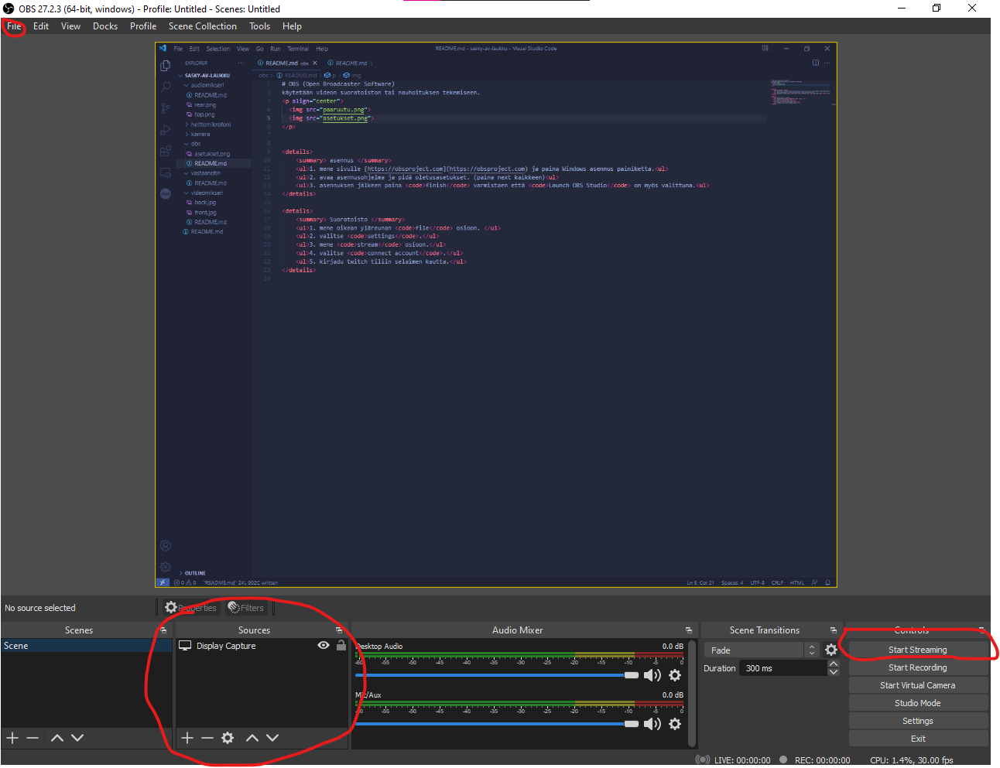
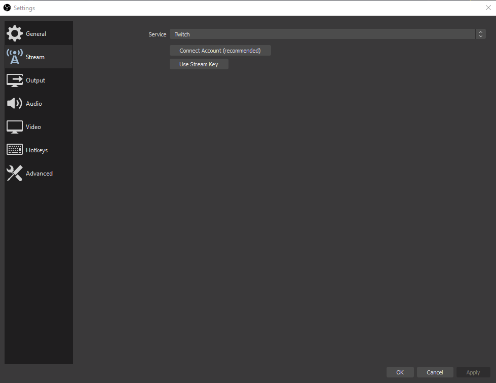

# OBS (Open Broadcaster Software)
käytetään videon suoratoiston tai nauhoituksen tekemiseen.

  
  

    
 asennus 

    <ul>1. mene sivulle <a href="htts://obsproject.com"> https://obsproject.com </a> ja paina Windows asennus painiketta.</ul>
    <ul>2. avaa asennusohjelma ja pidä oletusasetukset. (paina next kaikkeen)</ul>
    <ul>3. asennuksen jälkeen paina <code>finish</code> varmistaen että <code>Launch OBS Studio</code> on myös valittuna.</ul>

    
 Suoratoisto 

    <ul>1. mene oikean yläreunan <code>file</code> osioon. </ul>
    <ul>2. valitse <code>settings</code>.</ul>
    <ul>3. mene <code>stream</code> osioon.</ul>
    <ul>4. valitse <code>connect account</code>.</ul>
    <ul>5. kirjadu twitch tiliin selaimen kautta.</ul>
    <ul>6. mene takaisin pääruutuun ja paina start streaming.</ul>

    
 canvas 

    <ul>1. mene oikean alareunan <code>sources</code> osioon.</ul>
    <ul>2. lisää <code>+</code> painikkeesta <code>display capture</code>.</ul>
    <ul>3. valitse <code>create new</code> ja capture methodiksi automatic.</ul>
    <ul>4. paina ok. </ul>
    <ul>5. voit samaan tyyliin lisätä muita lähteitä esim <a href="../kamera/README.md">kameran.</a></ul>

