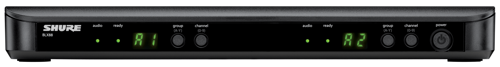
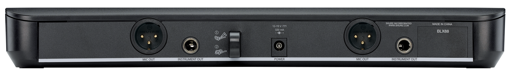
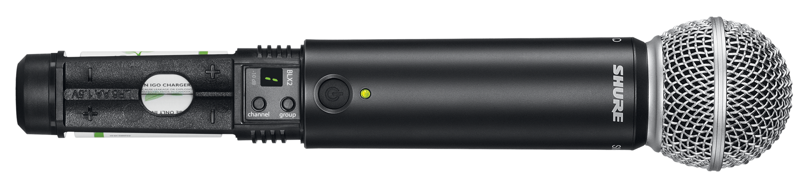
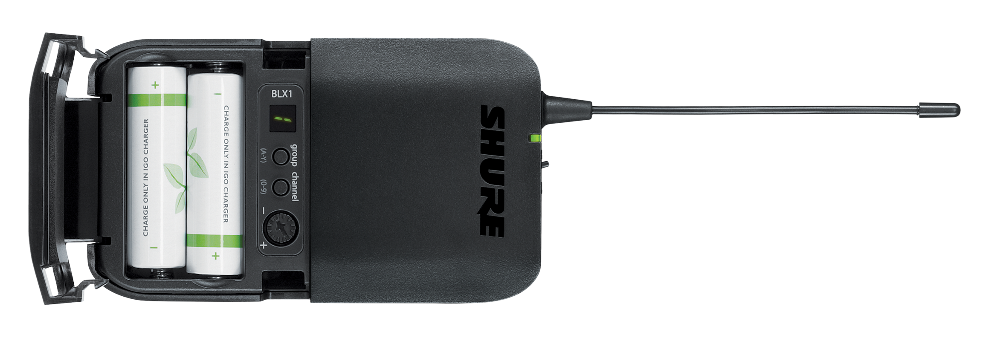

# Langattomat mikrofonit
käytetään mikrofonien effectien ja voimakkuuden säätöön, tämä ohje kattaa vain perus äänen sisääntulon tietokoneeseen.

## Tarvitaan
* XLR-kaapeli (2 kpl)
* virtajohto
* AA-koon paristoja (2 kpl / lähetin)

## Kuvat

  

  

  

  

## Ohje
1. Kytke virtajohto (barrel-plug tyylinen) laitteen taakse.
2. Kytke XlR-kaapeli laitteen takana olevaan `line out` porttiin.
3. Avaa mikrofonin paristoluukku ja paina `channel` ja `group` painiketta.
4. Paina vastaanottimen `channel` ja `group` painiketta, kunnes se vastaa mikrofonin näytössä olevia arvoja.
5. Kytke XLR-kaapelin toinen pää [audiomixeriin](../audiomikseri/README.md).

## Materiaalit
* [BLX Wireless System -esite](./BLX_Brochure.pdf)
* [Tuotesivu (BLX88)](https://techportal.shure.com/en/products/wireless-systems/blx_wireless/blx88)
* [Tuotesivu (BLX1)](https://www.shure.com/en-MEA/products/wireless-systems/blx_wireless/blx1)
* [Tuotesivu (BLX2/SM58)](https://www.shure.com/en-MEA/products/wireless-systems/blx_wireless/sm58-blx2)
* [Käyttöopas (englanti)](https://pubs.shure.com/guide/BLX/en-US)
