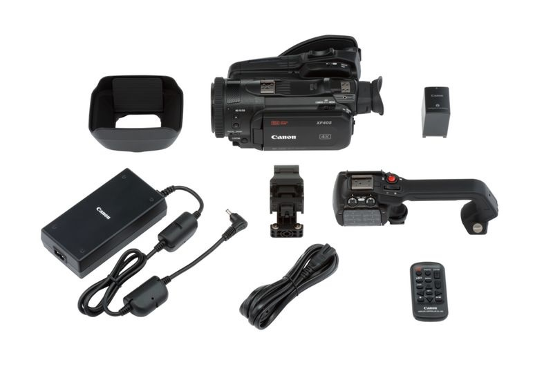

# Videokamera

Tässä ohjeessa neuvotaan, miten videokamera määritellään niin, että videokameran kuva siirretään videomikserille. Aseta [videomikseri](../videomikseri/) ensin käyttökuntoon.

## Videokameran käyttöön tarvitaan
* virtajohto
* sininen SDI-kaapeli tai musta HDMI-kaapeli
* (kamerajalka)

### Videokameran tarvikkeet

  

### Videokamera takaa (DC IN)

  

### Videokameran oikea sivu (SDI OUT & HDMI OUT)

  

### Videokameran vasen sivu 

  

## Videokameran käyttö
1. Kytke virtajohto kameran takaosan luukun alla olevaan `DC IN`-porttiin. ❶
2. Kytke SDI-kaapeli kameran sivulta löytyvän luukun alla `SDI OUT`-porttiin ja kytke kaapelin toinen pää [videomikseriin](../videomikseri/README.md). Voit vaihtoehtoisesti kytkeä videokameran videomikserin HDMI-kaapelilla, kytke tällöin kaapeli kameran `HDMI OUT` -porttiin. Huomaa, että HDMI-kaapeli saattaa vaatia adapterin, jotta sen voi kytkeä videokameraan. ❷
3. Kytke videokamera päällä siirtämällä kytkin `CAMERA`-asentoon. ❸ 
4. Avaa näyttöruudun luukku. ❹
5. Jos videokameran kuva ei näy videomikserissä, niin paina kameran takana `MENU`-nappia, valitse näyttöruudulta filmi-ikoni (toinen välilehti), sen alta `Internal/External Rec` -vaihtoehto ja valitse avautuvasta valikosta `External Rec Only (SDI)` tai `External Rec Only (HDMI)`. ❺
4. Jos käytät kamerajalkaa, niin muista varmistaa, että jalka on tukeva.

## Materiaalit
* [Tuotesivu](https://www.canon.fi/video-cameras/xf-405-and-xf-400/)
* [Pikaopas](quick-guide-fi.pdf)
* [Käyttöopas](manual-fi.pdf)