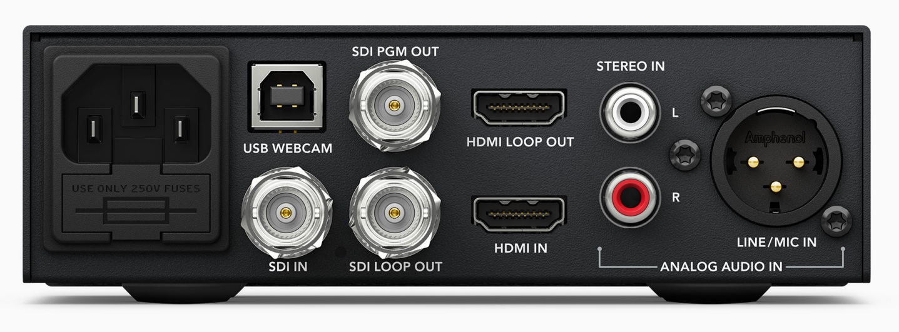

# video mixeri
käytetään kameran videosignaalin tietokoneeseen siirtoon.

## vaatii
* SDI kaapelin
* Kameran
* virtajohdon (sekä kameraan että mixeriin)

### etuosa

  

### takaosa

  

### käyttö

