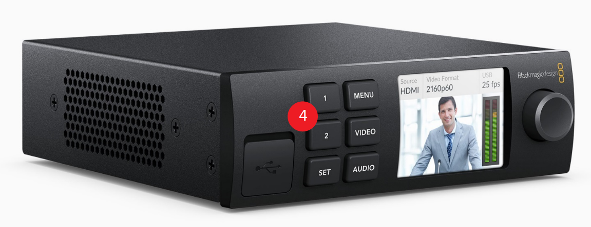

# Videomikseri

Videomikseriä käytetään videokameran kuvasignaalin siirtoon tietokoneelle.

## Videomikserin käyttöön tarvitaan
* virtajohto
* USB-johto (tyyppi A <-> tyyppi B)
* SDI-kaapeli tai HDMI-kaapeli
* (videokamera)

### videomikseri takaa

  

### videomikseri edestä

  

## Videomikserin käyttö
1. Kiinnitä virtajohto laitteen takaosaan. ❶
2. Kiinnitä USB-johto takaosan `USB WEBCAM` -porttiin ja liitä johdon toinen pää tietokoneeseen. ❷
3. Kiinnitä SDI-kaapeli takaosan `SDI IN` -porttiin. Halutessasi voit käyttää vaihtoehtoisesti HDMI-kaapelia, kytke kaapeli `HDMI IN` -porttiin. ❸
4. Valitse kaapelia vastaava kanava laitteen etuosasta. SDI-kaapelilla valitse kanava `1` ja HDMI-kaapelilla kanava `2`.  ❹

### Käyttö tietokoneella
 * Videomikseri näkyy automaattisesti tietokoneella `BLACKMAGIC` -nimisenä web-kamerana.
 * OBS-ohjelmassa saat lisättyä videomikserin seuraavasti:
    1. Valitse *Lähteet (sources)* -> *+ (Lisää lähde)* -> *Videokaappauslaite*.
    2. Valitse *Luo uusi* ja anna nimeksi `videomikseri`.
    3. Valitse *Laite*-kohtaan `BLACKMAGIC` ja paina *OK*.
    4. Videomikseri toimii web-kamerana OBS-ohjelmassa.
 * Teams-ohjelmassa valitse käytettäväksi web-kameraksi `BLACKMAGIC`.